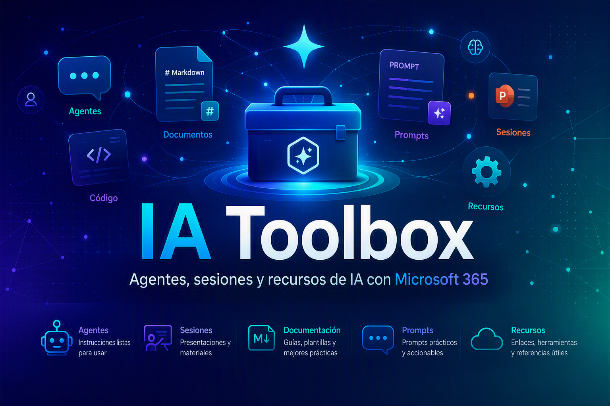

<!-- Reemplaza esta línea por tu banner: assets/img/banner.png -->

  

<h1 align="center">🧰 IA Toolbox · by Adrián Espés</h1>

  <b>IA aplicada · Microsoft Copilot · Agentes · Productividad digital</b> 
  Una caja de herramientas abierta y reutilizable: agentes, HTMLs visuales, prompts y guías.

  <a href="#-qué-encontrarás-aquí">Contenido</a> ·
  <a href="#-cómo-usarlo">Cómo usarlo</a> ·
   ·
  <a href="https://adrianespes.com">Web</a> ·
  <a href="https://aespese29.github.io/ia-toolbox/">Ver online</a>

  
  
  
  

---

## 👋 ¿Qué es esto?

Una **caja de herramientas** con recursos sencillos y reutilizables sobre IA aplicada y
Microsoft Copilot, pensados para que **cualquier persona** —tenga o no perfil técnico— pueda
copiar, adaptar y usar en su día a día.

> 🌐 **Míralo en web:** este repo se publica con **GitHub Pages**, así los HTMLs se ven
> renderizados (no como código): **https://aespese29.github.io/ia-toolbox/**

---

## 🧭 ¿Qué encontrarás aquí?

| Carpeta | Qué contiene |
|---|---|
| 🤖 [`/agentes`](./agentes) | Instrucciones de agentes de Copilot Studio, listas para copiar y pegar |
| 🎨 [`/htmls`](./htmls) | Informes visuales, infografías y plantillas HTML listas para abrir |
| 💬 [`/prompts`](./prompts) | La **Pronteca**: librería de prompts reutilizables por tarea |
| 📚 [`/tutoriales`](./tutoriales) | Guías paso a paso (Copilot, agentes, GitHub Pages…) |
| 📦 [`/recursos`](./recursos) | Cheat sheets, checklists y material descargable |
| 🖼️ [`/assets`](./assets) | Imágenes, logos y estilos compartidos |

---

## 🚀 Cómo usarlo

1. **Navega** por la carpeta que te interese (o entra por la web con GitHub Pages).
2. **Copia** lo que necesites: abre un HTML, o copia las instrucciones de un agente / un prompt.
3. **Adáptalo** a tu caso. Todo está pensado como punto de partida, no como algo cerrado.

> 💡 ¿Sin perfil técnico? Empieza por los [tutoriales](./tutoriales) y la [Pronteca](./prompts).

---

## 🤝 Sugerencias

Este repositorio está **curado personalmente**, así que no se aceptan subidas directas.
¿Tienes un prompt, un agente o un HTML que quieras compartir? Envíamelo por correo a
📧 **aespes@adrianespes.com** y, si encaja, lo publico dándote el crédito.
Más detalles en [**CONTRIBUTING.md**](./CONTRIBUTING.md).

---

## 📄 Licencia

Contenido bajo [**Creative Commons BY 4.0**](./LICENSE): puedes usarlo y adaptarlo
libremente citando la autoría. El código de ejemplo, bajo MIT.

---

  Hecho con ❤️ por <b>Adrián Espés</b> · Microsoft MVP · M365 Copilot 
  <a href="https://adrianespes.com">adrianespes.com</a>

