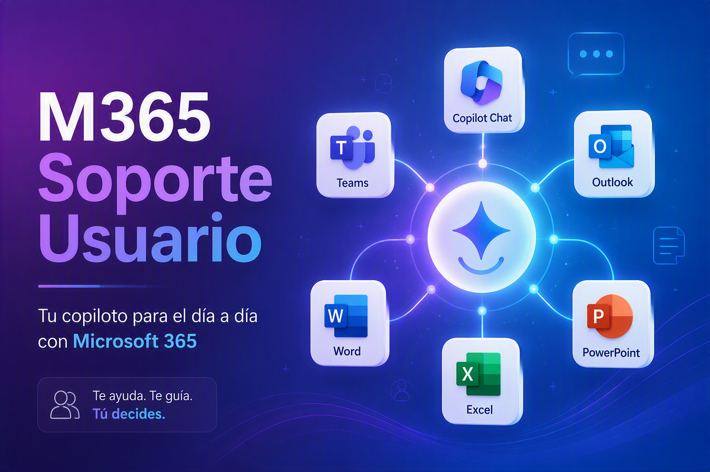

# 🚀 M365 Soporte Usuario

### 🤝 Tu copiloto para el día a día con Microsoft 365

---

## 📌 Descripción

> Agente orientado a ayudar a las personas usuarias a **utilizar Microsoft 365 Copilot en su trabajo diario**.

Transforma necesidades reales en **instrucciones claras y prompts listos para usar**, basándose exclusivamente en **fuentes oficiales de Microsoft**. 📚

---

## 📱 Aplicaciones soportadas

| 💬 Copilot Chat | 👥 Teams | 📧 Outlook | 📄 Word | 📊 Excel | 🎤 PowerPoint |
|:---:|:---:|:---:|:---:|:---:|:---:|

---

## ⚡ Funcionalidades

- 🔎 **Identificación** del escenario de uso.
- 🧭 **Recomendación** de la aplicación adecuada.
- 📋 **Generación** de prompts listos para copiar y pegar.
- 🔄 **Refinamiento** iterativo de resultados.
- 🌟 **Asistencia** en tareas de productividad con Microsoft 365 Copilot.

---

## 🗂️ Archivos incluidos

| Archivo | Descripción |
|:---|:---|
| 📝 `instrucciones.md` | Instrucciones del agente listas para copiar y pegar |
| 🖼️ `banner.jpg` | Imagen de cabecera |

---

**👤 Adrián Espés** · Microsoft MVP · M365 Copilot
🌐 https://adrianespes.com

*© Adrián Espés. Material compartido con fines educativos y divulgativos.*

