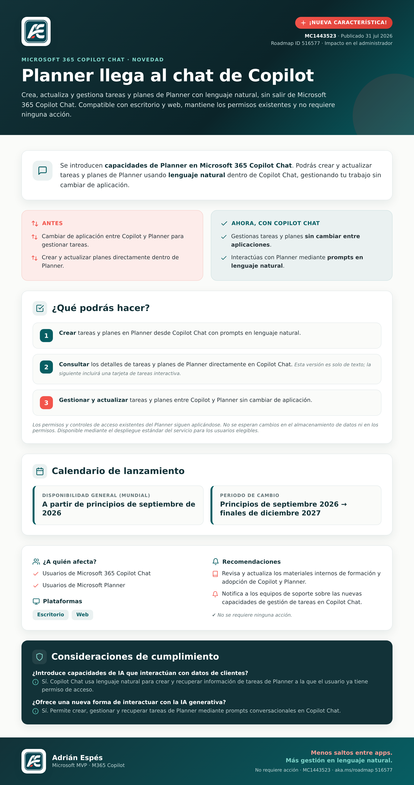

# Planner llega al chat de Copilot (MC1443523)

Microsoft 365 Copilot Chat permitirá **crear, consultar y actualizar tareas y planes de Planner
usando lenguaje natural**, sin cambiar de aplicación. Mantiene los permisos existentes y **no
requiere ninguna acción**.

## 📌 Ficha

| Campo | Detalle |
|---|---|
| **ID de mensaje** | MC1443523 |
| **Roadmap ID** | [516577](https://www.microsoft.com/microsoft-365/roadmap?searchterms=516577) |
| **Publicado** | 31 jul 2026 |
| **Disponibilidad general (mundial)** | A partir de principios de septiembre de 2026 |
| **Plataformas** | Escritorio · Web |
| **Servicios** | Microsoft 365 Copilot · Copilot Chat · Planner |
| **Acción requerida** | Ninguna |

## ✨ En resumen

- **Crea** tareas y planes en Planner desde Copilot Chat con prompts en lenguaje natural.
- **Consulta** los detalles de tareas y planes directamente en el chat (esta versión es solo de
  texto; una próxima incluirá una tarjeta de tareas interactiva).
- **Gestiona y actualiza** tareas y planes entre Copilot y Planner sin cambiar de aplicación.
- Se respetan los **permisos y controles de acceso** existentes de Planner.

## 🗂️ Formatos disponibles

- 🖼️ [Imagen (PNG)](AE_Infografia_CopilotPlanner_LinkedIn_v01.png) — visualización rápida / redes.
- 📄 [Documento (PDF)](AE_Infografia_CopilotPlanner_v01.pdf) — descarga e impresión.

---

> Basado únicamente en información pública del anuncio oficial (Centro de mensajes M365).

**Adrián Espés** · Microsoft MVP · M365 Copilot · [adrianespes.com](https://adrianespes.com)
