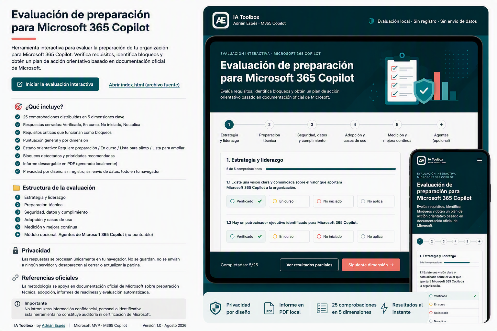

# Evaluación de preparación para Microsoft 365 Copilot



Herramienta interactiva para evaluar el estado de preparación de una organización antes de desplegar **Microsoft 365 Copilot**.

La evaluación ayuda a:

- comprobar requisitos esenciales;
- identificar bloqueos críticos;
- conocer el nivel de preparación por dimensión;
- priorizar las acciones pendientes;
- y generar un informe simple con los resultados.

> **Importante:** el resultado es orientativo y está basado en requisitos, guías y recomendaciones oficiales de Microsoft. No constituye una certificación oficial, una auditoría técnica ni una validación automática de la configuración del tenant.

## Abrir la evaluación interactiva

**[Iniciar la evaluación de preparación para Microsoft 365 Copilot](https://aespese29.github.io/ia-toolbox/recursos/evaluacion-preparacion-m365-copilot/index.html)**

La evaluación se abre directamente en el navegador mediante GitHub Pages. No necesitas instalar aplicaciones, descargar archivos ni iniciar sesión.

También puedes [consultar el archivo fuente `index.html`](./index.html) dentro del repositorio.

## Qué incluye

- 25 comprobaciones distribuidas en cinco dimensiones.
- Respuestas cerradas: **Verificado**, **En curso**, **No iniciado** y **No aplica**.
- Requisitos críticos que funcionan como bloqueos.
- Puntuación general y puntuación por dimensión.
- Estado orientativo de preparación.
- Bloqueos detectados y prioridades recomendadas.
- Módulo complementario para evaluar la preparación para agentes.
- Informe de resultados que puede guardarse localmente como PDF.

## Dimensiones evaluadas

### 1. Estrategia y liderazgo

Objetivos, patrocinio ejecutivo, equipo responsable, alcance del piloto y criterios de éxito.

### 2. Preparación técnica

Licenciamiento, identidad, Exchange Online, compatibilidad de aplicaciones, canales de actualización y conectividad.

### 3. Seguridad, datos y cumplimiento

Permisos, acceso a la información, protección de datos, auditoría y controles de cumplimiento.

### 4. Adopción y casos de uso

Grupo piloto, escenarios prioritarios, champions, formación, comunicación, comunidad y soporte.

### 5. Medición y mejora continua

Métricas, feedback, revisión de uso, casos de éxito y criterios para ampliar el despliegue.

### Módulo complementario de agentes

Evalúa aspectos básicos de definición, conocimiento, permisos, costes, publicación y mantenimiento de agentes.

Este módulo es opcional y **no modifica el resultado principal** de preparación para Microsoft 365 Copilot.

## Cómo funciona la puntuación

Cada comprobación utiliza una respuesta cerrada:

- **Verificado:** 2 puntos.
- **En curso:** 1 punto.
- **No iniciado:** 0 puntos.
- **No aplica:** se excluye del cálculo.

```text
Puntuación = puntos obtenidos / puntos posibles aplicables × 100
```

Los requisitos imprescindibles funcionan como controles de bloqueo. Una puntuación elevada no compensa un requisito crítico sin resolver.

## Estados de preparación

### Requiere preparación

Existe al menos un requisito crítico sin resolver.

### Preparación en curso

Los requisitos críticos se han cubierto total o parcialmente, pero todavía faltan elementos relevantes para iniciar un piloto controlado.

### Preparada para piloto

La organización dispone de las condiciones orientativas para comenzar un piloto controlado y medir sus resultados.

### Preparada para ampliar

La organización presenta un nivel alto de preparación y puede valorar una ampliación controlada utilizando sus criterios de gobierno y medición.

> Microsoft no publica una puntuación universal que certifique el nivel de preparación de una organización. Los niveles y umbrales de esta herramienta son criterios orientativos de IA Toolbox.

## Informe de resultados

Al finalizar la evaluación se muestra:

- el estado general;
- la puntuación orientativa;
- el resultado por dimensión;
- el número de bloqueos críticos;
- las comprobaciones pendientes;
- las prioridades recomendadas;
- y, si se completa el módulo opcional, el resultado de preparación para agentes.

La opción **Guardar informe en PDF** abre la función de impresión del navegador. Desde ella puedes seleccionar **Guardar como PDF**.

## Privacidad por diseño

La evaluación funciona completamente en el navegador.

- Las respuestas se procesan localmente mediante JavaScript.
- No se envían respuestas a ningún servidor.
- No se utilizan formularios externos, APIs ni bases de datos.
- No se utilizan cookies, `localStorage` ni `sessionStorage`.
- No se integran servicios de analítica.
- No se solicitan nombres, correos, dominios, archivos ni información identificativa.
- Las respuestas desaparecen al actualizar o cerrar la página.
- El informe se genera y se guarda únicamente en el dispositivo de la persona usuaria.

### No introduzcas información confidencial

La evaluación solo necesita conocer el estado de cada comprobación. No introduzcas ni compartas:

- información confidencial de la organización;
- datos personales o identificativos;
- nombres de clientes, personas, proyectos o departamentos;
- configuraciones internas de seguridad;
- credenciales, claves o información de acceso;
- documentos, capturas o contenido corporativo;
- detalles técnicos que puedan revelar la configuración del tenant.

## Alcance y limitaciones

El resultado no constituye:

- una certificación oficial de Microsoft;
- una auditoría técnica o de seguridad;
- una evaluación de cumplimiento normativo;
- una validación automática de la configuración del tenant;
- ni una garantía de preparación para desplegar Microsoft 365 Copilot.

Para comprobar la configuración real de un entorno deben utilizarse las herramientas e informes oficiales de Microsoft y realizarse las revisiones técnicas, de seguridad, cumplimiento y adopción correspondientes.

## Referencias oficiales

- [Microsoft Copilot Readiness Report](https://learn.microsoft.com/en-us/microsoft-365/admin/activity-reports/microsoft-365-copilot-readiness?view=o365-worldwide)
- [Microsoft Copilot adoption and onboarding guide for IT admins](https://learn.microsoft.com/en-us/microsoft-365/copilot/microsoft-365-copilot-enablement-resources)
- [Microsoft 365 Copilot adoption planning checklist](https://adoption.microsoft.com/en-us/copilot/essential-guide/plan/)
- [Microsoft 365 Copilot Adoption Playbook](https://www.microsoft.com/en-us/microsoft-365-copilot/copilot-adoption-guide)
- [Automated Readiness Assessment for Microsoft 365 Copilot and Agents](https://github.com/microsoft/m365-copilot-automated-readiness-assessment)

## Verificación técnica de la versión 1.0

La versión 1.0 se ha revisado para confirmar que:

- no transmite ni conserva respuestas;
- no utiliza cookies ni almacenamiento local o de sesión;
- no contiene formularios de envío;
- no permite subir archivos;
- no integra servicios de analítica;
- no solicita información confidencial;
- y no necesita datos identificativos para calcular el resultado.

**Fecha de verificación técnica:** 20 de agosto de 2026.

## Estructura del recurso

Crea la estructura desde la **raíz del repositorio**, evitando repetir el nombre de una carpeta:

```text
ia-toolbox/
└── recursos/
    └── evaluacion-preparacion-m365-copilot/
        ├── README.md
        ├── index.html
        └── banner-evaluacion-preparacion-m365-copilot.png
```

Los tres archivos deben estar en la misma carpeta.

## Publicación mediante GitHub Pages

Configura GitHub Pages con:

```text
Source: Deploy from a branch
Branch: main
Folder: /(root)
```

Con esa estructura, la evaluación estará disponible en:

```text
https://aespese29.github.io/ia-toolbox/recursos/evaluacion-preparacion-m365-copilot/index.html
```

## Uso y contribuciones

Este recurso forma parte de **IA Toolbox**, una colección de materiales prácticos sobre inteligencia artificial aplicada, Microsoft 365 Copilot y agentes.

Si detectas un punto que deba actualizarse o quieres proponer una mejora, puedes abrir una incidencia en el repositorio.

---

**Adrián Espés** · Microsoft MVP · M365 Copilot  
[adrianespes.com](https://adrianespes.com)

**Versión:** 1.0  
**Publicado:** 20 de agosto de 2026
