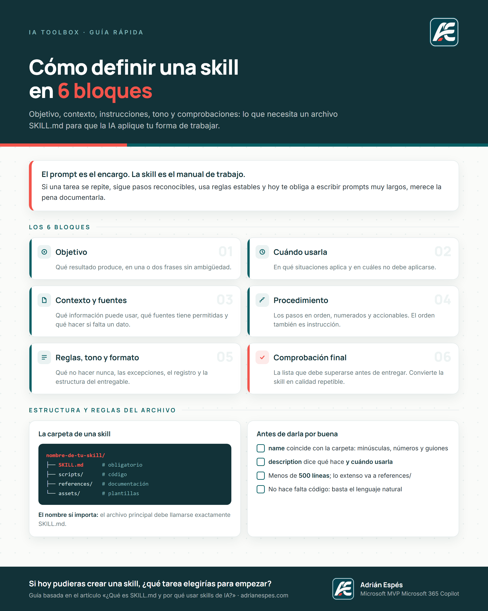

# 🧩 Plantilla SKILL.md — Define tu skill en 6 bloques

Una guía sencilla para definir **objetivos, instrucciones, tono y contexto** de una skill de IA
de forma estructurada, para que cualquier asistente (Copilot, Claude, ChatGPT…) trabaje siempre
con el mismo criterio.

## 🚀 Empezar

👉 **[Abrir el recurso](https://aespese29.github.io/ia-toolbox/recursos/plantilla-skill-md/)**

## 🗂️ Formatos disponibles

| Formato | Para qué sirve | Descargar |
|---|---|---|
| 📝 **Plantilla `.md`** | Rellenar y guardar como `SKILL.md` en tu carpeta de skill | [SKILL.md](SKILL.md) |
| 📄 **Guía A4 (PDF)** | Consulta rápida e impresión | [AE_Guia_SkillMd_6Bloques_A4.pdf](AE_Guia_SkillMd_6Bloques_A4.pdf) |
| 🖼️ **Infografía (PNG)** | Visualización rápida y redes | [AE_Infografia_SkillMd.png](AE_Infografia_SkillMd.png) |

## 🧱 Los 6 bloques

1. **Identidad** — nombre y descripción en una frase que active la skill.
2. **Objetivo** — qué resuelve y qué resultado entrega.
3. **Cuándo usarla** — señales de activación y cuándo *no* usarla.
4. **Instrucciones** — los pasos del proceso, en orden.
5. **Tono y formato** — cómo debe sonar y cómo se entrega el resultado.
6. **Contexto y límites** — datos de referencia y reglas que no se saltan.

## 🛠️ Cómo utilizarla

1. Descarga la plantilla y renómbrala como `SKILL.md`.
2. Crea una carpeta con el nombre de la skill en minúsculas y con guiones.
3. Rellena los seis bloques (empieza por Identidad y Objetivo).
4. Prueba la skill con un caso real y ajusta las instrucciones con lo que falle.

## 📖 Contexto

Recurso basado en el artículo
**[¿Qué es SKILL.md y por qué usar skills de IA?](https://adrianespes.com/que-es-skill-md/)**

---

**Adrián Espés** · Microsoft MVP · Microsoft 365 Copilot · [adrianespes.com](https://adrianespes.com)
