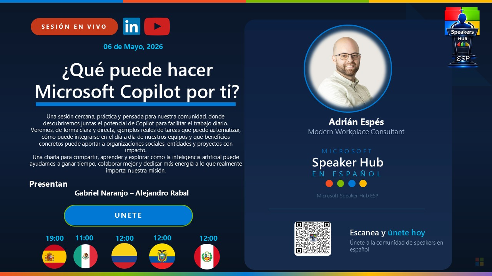

# What can Microsoft Copilot do for you?

[Spanish](README.md) · [English](README.en.md)

An introductory session on Microsoft Copilot and Microsoft 365 Copilot, designed to explore real-world use cases for improving personal and professional productivity.

## Content

- What is Microsoft Copilot?
- Copilot Chat vs. Microsoft 365 Copilot
- Security, privacy, and compliance
- Use cases in Outlook, Teams, Word, Excel, and PowerPoint
- Researcher and Analyst
- Agents with Copilot Studio

## Available material

- Session presentation (PDF)

## Speaker

**Adrián Espés** 
Microsoft MVP · M365 Copilot

## Contact

📧 aespes@adrianespes.com

🔗 LinkedIn: https://linkedin.com/in/adrianespes

---

© Adrián Espés. Material shared for educational and informational purposes.
